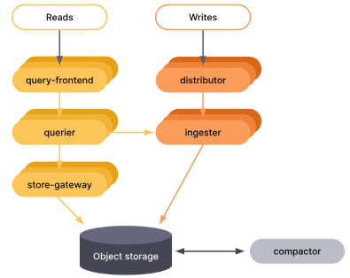

# Mimir

## Manage Grafana Mimir using Helm

### Install Grafana Mimir

**Step 1:** Create `mimir` namespace for managing and isolating resources of Grafana Mimir within a cluster:

```bash
kubectl create ns mimir
```

**Step 2:** Add and update Grafana Helm repository for the latest Mimir Helm chart:

```bash
helm repo add grafana https://grafana.github.io/helm-charts
helm repo update
```

**Step 3:** Install Grafana Mimir using the Helm chart:

```bash
kubectl config set-context --current --namespace mimir
helm install mimir grafana/mimir-distributed
```

**Step 4:** Verify that all Pods of Grafana Mimir is running normally:

```bash
kubectl get pods -n mimir
```

### Update Grafana Mimir

Assume that you are in the root directory of this project (i.e. `hola-k8s-apps`), run the following command to update Grafana Mimir:

```bash
kubectl config set-context --current --namespace mimir
helm upgrade mimir grafana/mimir-distributed -f ./monitoring/mimir/values.yaml
```

## Microservices Mode Deployment

`grafana/mimir-distributed` Helm chart uses the microservices mode deployment - Components are deployed in distinct processes => Scaling can be done per component:



### Grafana Mimir Distributor

### Grafana Mimir Ingester
