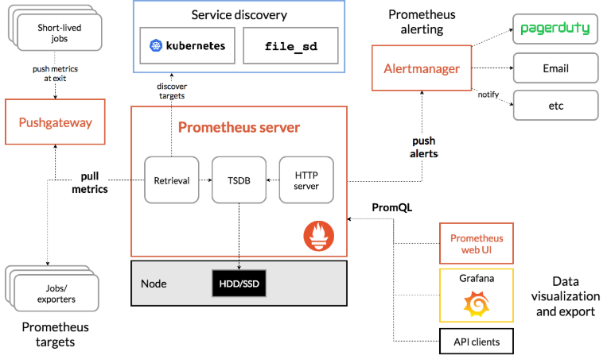

# Prometheus

**Prometheus** is an OSS monitoring and alerting toolkit. It collects and stores its metrics as time series data.

## Prometheus Architecture



## kube-prometheus-stack Helm chart

**Step 1:** Add Helm repository:

```bash
helm repo add prometheus-community https://prometheus-community.github.io/helm-charts
```

**Step 2:** Install Helm chart:

```bash
helm install monitoring prometheus-community
```
